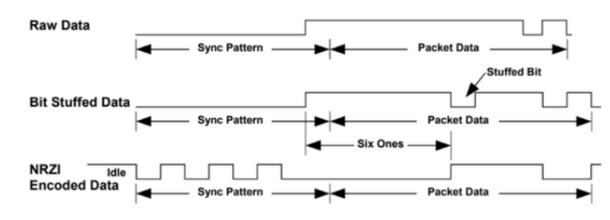
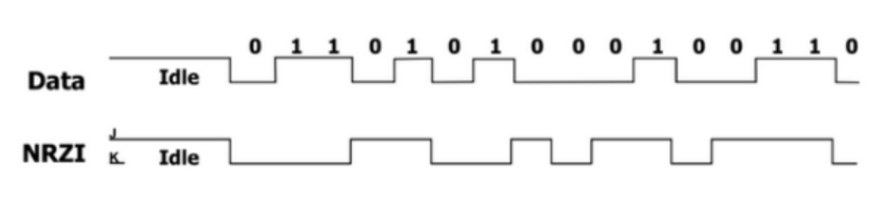
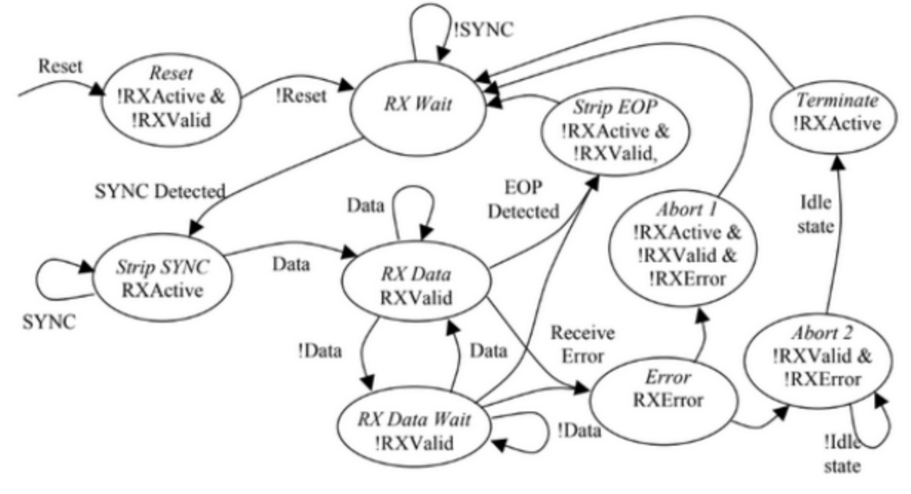
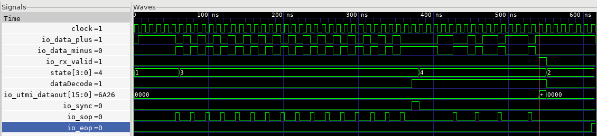
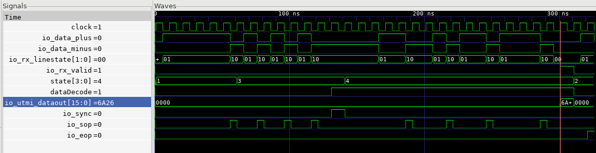

# USB 2.0 - RX

This folder contains Scala for USB2.0 RX logic, meant to integrate with the larger USB2.0 project integrated into Chipyard.

- The High Speed Mode takes in 480 MHz and outputs 30 Mhz to UTMI.
- The Fast Speed Mode takes in 12 MHz and outputs .75 MHz to UTMI.

# RX At-A-Glance

This documentation covers the implementation of a USB 2.0 receiver within the SKY130 process technology for integration into Chipyard, an agile RISC-V SoC design framework. The receiver consists of a **finite state machine, NRZI decoder, bit unstuffer, and a serial to parallel data converter**, which will integrate into the top-level USB 2.0 Chipyard generator, invoked into an SoC with a configuration mixin. While the USB protocol is one of the most common interfaces, there was no previous USB support in Chipyard. This work will allow for improved host-to-peripheral communication and continued development of the open-source SoC design space with the SKY130 PDK.

The current top level I/O list is shown below.

| I/O               | Type   | Width          | Info                                        |
| ----------------- | ------ | -------------- | ------------------------------------------- |
| utmi_dataout      | Output | datawidth bits | Parallel output data                        |
| utmi_rx_valid     | Output | 1 bit          | RX valid signal                             |
| utmi_rx_active    | Output | 1 bit          | RX active signal                            |
| utmi_rx_error     | Output | 1 bit          | RX error signal                             |
| utmi_rx_linestate | Output | 2 bits         | Line state                                  |
| data_d_plus       | Input  | 1 bit          | D+                                          |
| data_d_minus      | Input  | 1 bit          | D-                                          |
| reset             | Input  | Reset          | Reset                                       |
| clk               | Input  | Clock          | Clock (480 MHz)                             |
| cru_hs_toggle     | Input  | 1 bit          | HS/FS mode select. High if high speed mode. |

# NRZI Decoder

The serial data will first go through our NRZI decoder because we do bit stuffing on the original data before it is NRZI encoded. By decoding our NRZI data first, we can see which bit to unstuff. To implement this, we store the previous value and compare it with an XNOR operation with the J chirp data. The previous register initial value is 1 because the USB synchronization starts with 00000001. The output of the NRZI decoder is our original data that may have a stuffed bit or not. The enable signal comes from the state machine, and is high when it is in RX_DATA state to start decoding data.

NRZI encoded data. Note how 0 is the transition and 1 is no transition (i.e. at 0 we see a change in level). Looking at Chirp J, we only need to XNOR this with the previous value, assuming the initial value of the previous register is 1.

| I/O               | Type   | Width | Info                             |
| ----------------- | ------ | ----- | -------------------------------- |
| Data In (J chirp) | Input  | 1 bit | Data in (J chirp)                |
| Data Out          | Output | 1 bit | NRZI decoded data                |
| Enable            | Input  | 1 bit | High if current state is RX_DATA |

# Bit Unstuffing

The next step into correctly packetizing our data is to unstuff any stuffed bits. With the decoded NRZI data, we can process each bit. We do bit unstuffing after NRZI because we stuff bits in the original data to force a NRZI transition when we NRZI encode the data. The unstuffing block will strip the stuffed zero bits and detect bit stuff errors since a zero is inserted after every six consecutive ones in the data stream.

Below are the I/Os, we have the error signal that will be toggled high if bit unstuff errors are detected. Bit unstuff errors occur when the 7th bit is not 0 after 6 consecutive 1s. There is also an enable signal from the state machine that is toggled high when the current state is in RX_DATA to start processing the data. There is also a valid signal, which will tell the serial to parallel converter whether to hold the bit or ignore the bit stuffed bit. Valid is not high if the current bit is a stuffed bit.

| I/O      | Type   | Width | Info                                                     |
| -------- | ------ | ----- | -------------------------------------------------------- |
| Error    | Output | 1 bit | High if bit unstuff error                                |
| Data Out | Output | 1 bit | Unstuffed data output                                    |
| Data In  | Input  | 1 bit | NRZI decoded data input                                  |
| Enable   | Input  | 1 bit | Input from RX state machine; high if state is RX_DATA    |
| Valid    | Output | 1 bit | High if current bit is not a stuffed bit and vice versa. |

# Serial-to-Parallel Conversion

The serial-to-parallel conversion block takes in serial data at 480 (HS) or 12 (FS) MHz received from the analog frontend and CRDU and converts it to 16-bit parallel data (30Mhz or 0.75MHz). It is simply a shift and hold register that is able to take 1 bit serial data and hold them to make it parallel 16 bit data. The converter is also parametrizable based on the `datawidth`.

Below are the I/Os, we currently have a valid signal from the bit unstuffer to tell us whether the current data input is a stuffed bit or not. We will ignore the bit if it is a stuffed bit. It keeps going until the hold registers are full and it finishes collecting the 16 bit data. Once it is done, the ready signal will be toggled high and will be inputted to the RX state machine. The RX state machine will use this signal to transition from RX_DATA to STRIP_EOP state and output the data to UTMI.

| I/O      | Type   | Width         | Info                                                                                    |
| -------- | ------ | ------------- | --------------------------------------------------------------------------------------- |
| Ready    | Output | 1 bit         | High if parallel data is ready to be outputted                                          |
| Data Out | Output | datawidth bit | Parallel data output                                                                    |
| Data In  | Input  | 1 bit         | Serial data input                                                                       |
| Valid    | Output | 1 bit         | Signal from bit unstuffer; high if the serial data is not a stuffed bit and vice versa. |

# RX State Machine

The RX finite state machine handles handshake signals received and outputted to the UTMI interface, serves as a control to the other blocks, and detects SYNC and EOP packets. Given a handshake, it will output data to the UTMI. It is parametrizable based on `datawidth`. The receiver state diagram is shown below.

1. We first initialize our state to the `RESET` state. At this state, the active and valid signals are not turned on. Once reset is finished we will go to the `RX_WAIT` state. We are assuming that we do not have to do reset detection and extraction from the packets. We are getting a reset input, but it seems like currently that is coming from UTMI.
2. After we are in the RX wait state, we will have to detect the start of the packet (SOP), which is when it goes from idle state to K state. For FS (full-speed), the idle state is the J state, and for HS (high speed), the idle state is SE0 (both D+ and D- low). Once we detect the start of the packet, we transition to the `STRIP_SYNC` state and toggle our active signal.
3. In the `STRIP_SYNC` state, we are going to “strip” our sync pattern depending on the mode. For LS/FS, the sync pattern is KJKJKJKK (8 symbols) and for HS the sync pattern is KJ * 15 + KK (32 symbols). After we “strip” (aka. wait) out the sync pattern, we will transition over to the `RX_DATA` state.
4. In the `RX_DATA` state, we will extract and fill up our serial to parallel converter (shift/hold registers) with our data. We will toggled the `data_decode` signal, which is analogous to the `enable` signal that is fed to the NRZI decoder and bit unstuffer blocks. This state will also tell us the error we have, if we have any. Currently, only two types of errors are supported in our design: SE1 state and bit unstuff errors. Currently, we do not have RX_DATA_WAIT state because we have a internal signal from the serial to parallel converter to tell us when it is done collecting data and we will assert active and valid both high once that is done. The valid signals will be handled accordingly, when the serial to parallel converter block toggles its ready signal high and we can send the data to UTMI, after which we can transition to the `STRIP_EOP` state.
5. In the `RX_DATA` state, if we detect no errors, we simply go to the `STRIP_EOP` state where we “strip” the EOP pattern. In LS/FS, the EOP pattern is {SE0, SE0, J} and for HS the pattern is J*8 or K*8. After that we go back to the RX_WAIT state and wait for another packet.
6. In the `RX_DATA` state, if we have an error, we go to the `RX_ERROR` state. There are two ABORT paths, `ABORT1` and `ABORT2`. ABORT2 is for bit unstuffing errors and so we will transition to the state accordingly and go to the `TERMINATE` state to terminate the current receive.

Below are the current I/O for the state machine.

| I/O             | Type   | Width         | Info                                                                           |
| --------------- | ------ | ------------- | ------------------------------------------------------------------------------ |
| linestate       | Output | 2 bit         | Line state signal                                                              |
| Data Out        | Output | dataWidth bit | Data output to UTMI                                                            |
| Data In         | Input  | datawidth bit | Data output from serial to parallel converter                                  |
| rx_valid        | Output | 1 bit         | RX valid signal to UTMI                                                        |
| rx_active       | Output | 1 bit         | RX active signal to UTMI                                                       |
| rx_error        | Output | 1 bit         | RX error signal to UTMI                                                        |
| data_decode     | Output | 1 bit         | High in RX_DATA state. Fed into NRZI decoder and bit unstuffer as enable input |
| reset           | Input  | 1 bit         | Reset signal                                                                   |
| serial_ready    | Input  | 1 bit         | Serial to parallel block ready output                                          |
| bitunstufferror | Input  | 1 bit         | Bit unstuff error indicator                                                    |
| hs_toggle       | Input  | 1 bit         | HS or FS mode select                                                           |
| data_d_plus     | Input  | 1 bit         | D+                                                                             |
| data_d_minus    | Input  | 1 bit         | D-                                                                             |

Within the state machine, we have a module called `SYNC_EOP_LS` that will handle all of the SOP, SYNC, EOP detection. It will also handle the line state signals that will be send to the UTMI. Based on whether is it high speed or full speed, it will handle the detections and stripping accordingly.

The I/O for the module is below.

| I/O          | Type   | Width | Info                          |
| ------------ | ------ | ----- | ----------------------------- |
| data_d_plus  | Input  | 1 bit | D+                            |
| data_d_minus | Input  | 1 bit | D-                            |
| hs_toggle    | Input  | 1 bit | High if HS mode               |
| linestate    | Output | 2 bit | Linestate                     |
| sop          | Output | 1 bit | Start of Packet               |
| se0          | Output | 1 bit | SE0                           |
| se1          | Output | 1 bit | SE1                           |
| j            | Output | 1 bit | J chirp                       |
| k            | Output | 1 bit | K chirp                       |
| sync         | Output | 1 bit | High if SYNC pattern detected |
| eop          | Output | 1 bit | High if EOP pattern detected  |

Below are some waveforms from the tests we ran. We can observe that there is an IDLE state and then a SOP gets triggered. Afterwards, the SYNC get's detected and we see the data being collected with EOP at the end. Above is HS and below is FS mode.

# Full Report

[Final Report ](https://drive.google.com/file/d/11gZbgfyL5_FKiPavifnPZaLmK8Hp6I0c/view?usp=sharing)Update link lucy -jason
